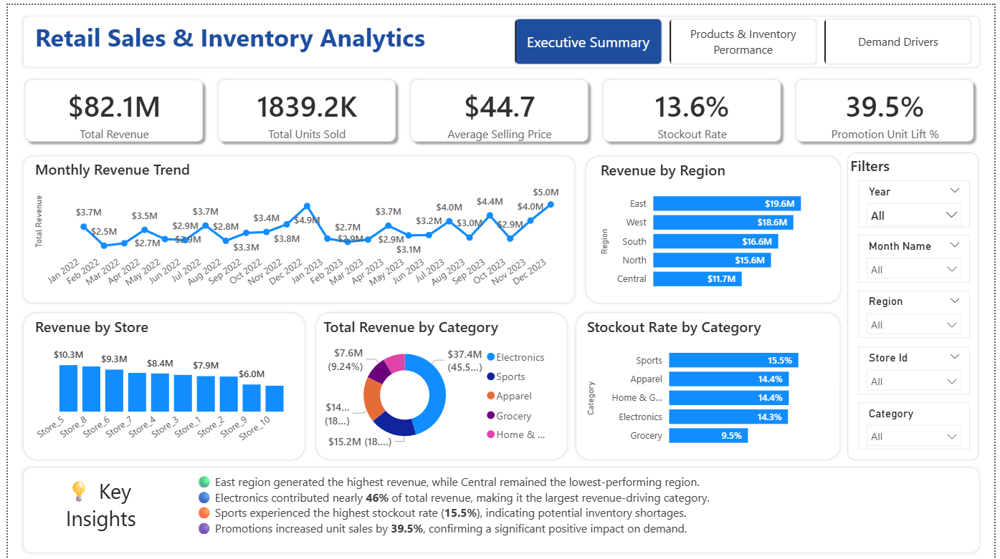
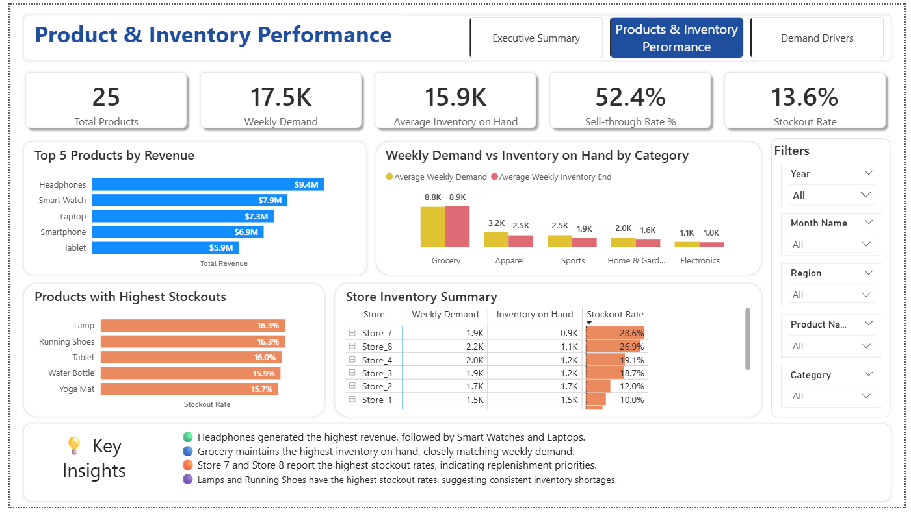
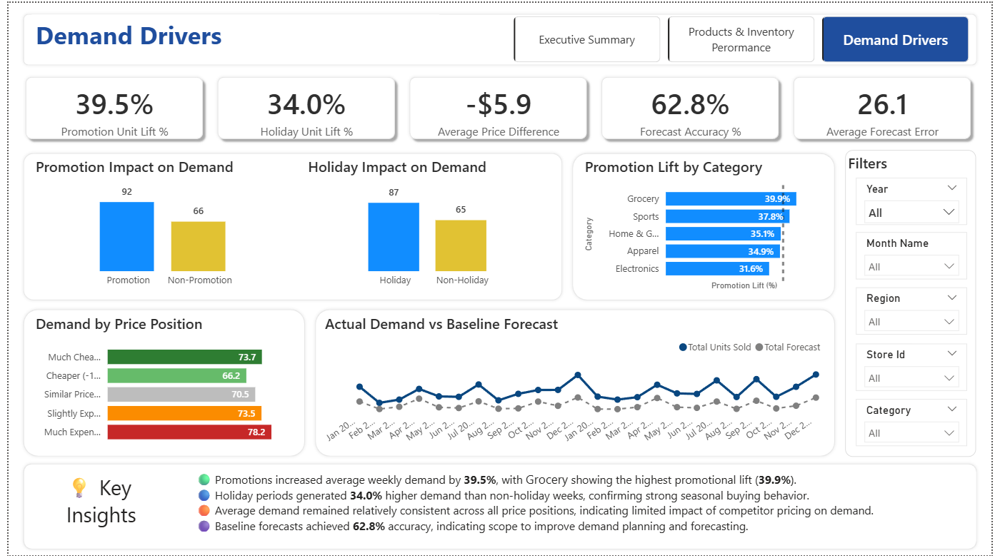

# 📊 Retail Sales & Inventory Analytics Dashboard

An end-to-end retail analytics project built to analyze **sales performance, inventory management, promotional effectiveness, competitive pricing, and demand forecasting** using Power BI and supporting data-analysis tools.

The project transforms raw retail data into an interactive **business intelligence dashboard** designed to help decision-makers monitor KPIs, identify performance gaps, understand sales drivers, and improve inventory planning.

---

## 📌 Project Overview

The retail business operates across **10 stores and 5 regions**, selling products across five major categories:

* Electronics
* Grocery
* Apparel
* Home & Garden
* Sports

The dataset contains weekly retail observations covering **2022–2023**.

The analysis focuses on understanding the relationship between sales, inventory, promotions, holidays, competitor pricing, and forecast demand.

---

## 🎯 Business Problem

Retail businesses need to balance **sales growth, customer demand, inventory availability, and profitability** while responding to promotions, holidays, and competitive pricing.

Without a centralized analytics solution, decision-makers may struggle to:

* Monitor overall sales performance
* Identify high- and low-performing stores and regions
* Evaluate product and category performance
* Measure promotional effectiveness
* Detect inventory shortages and stockout risks
* Understand seasonal demand patterns
* Compare prices with competitors
* Evaluate forecast performance

This project addresses these challenges through exploratory analysis, data modeling, DAX-based KPI development, and an interactive Power BI dashboard.

---

## 🎯 Project Objectives

The project aims to:

1. Analyze overall sales performance and demand trends.
2. Evaluate store, regional, product, and category performance.
3. Measure the impact of promotions and holidays on sales.
4. Analyze inventory utilization and stockout patterns.
5. Compare product pricing against competitor prices.
6. Evaluate forecast performance and forecast error.
7. Develop an interactive Power BI dashboard for business monitoring and decision-making.
8. Translate analytical findings into actionable business recommendations.

---
## 📸 Dashboard Preview

### Executive Overview



### Product & Inventory Performance



### Demand Drivers 



---

## 📂 Dataset

The dataset contains weekly retail sales and inventory observations covering **2022–2023**.

### Dataset Coverage

| Dimension   | Details   |
| ----------- | --------- |
| Stores      | 10        |
| Regions     | 5         |
| Products    | 25        |
| Categories  | 5         |
| Time Period | 2022–2023 |
| Frequency   | Weekly    |

### Key Attributes

* Date
* Store
* Region
* Product
* Category
* Sales Quantity
* Revenue
* Unit Price
* Competitor Price
* Inventory Levels
* Promotion Flag
* Holiday Flag
* Stockout Flag
* Forecast Quantity

---

## 🛠️ Tools & Technologies

| Tool               | Purpose                                      |
| ------------------ | -------------------------------------------- |
| **Power BI**       | Dashboard development and data visualization |
| **DAX**            | KPI and business metric development          |
| **Power Query**    | Data transformation and preparation          |
| **SQL / MySQL**    | Data querying and analytical analysis        |
| **Python**         | Exploratory data analysis                    |
| **Pandas & NumPy** | Data manipulation and analysis               |
| **Matplotlib**     | Exploratory visualizations                   |
| **Excel**          | Data inspection and validation               |

---

## 🔄 Project Workflow

The project follows an end-to-end analytics workflow:

**Raw Data → Data Cleaning → EDA → Data Modeling → DAX Measures → Dashboard Development → Business Insights → Recommendations**

### 1. Data Preparation

* Inspected the dataset for missing values and inconsistencies.
* Validated data types and business fields.
* Prepared analytical dimensions and fact data.
* Transformed data using Power Query where required.

### 2. Exploratory Data Analysis

EDA was used to understand:

* Sales trends
* Product performance
* Category performance
* Regional performance
* Inventory patterns
* Promotions
* Holidays
* Competitor pricing
* Forecast behavior

### 3. Data Modeling

A dimensional/star-schema approach was used to organize the Power BI model.

The model separates:

* **Fact Sales**
* **Product Dimension**
* **Store Dimension**
* **Date Dimension**

This structure supports scalable reporting and efficient DAX calculations.

### 4. DAX & KPI Development

Key measures include:

* Total Revenue
* Total Units Sold
* Average Weekly Sales
* Stockout Rate
* Promotion Revenue
* Promotion Lift %
* Forecast Error
* Absolute Forecast Error

---

# 📊 Dashboard

The Power BI dashboard consists of **three analytical pages**.

## 1️⃣ Executive Overview

Provides a high-level view of overall business performance.

### KPIs

* Total Revenue
* Total Units Sold
* Average Weekly Sales
* Stockout Rate
* Promotion Sales Lift

### Visual Analysis

* Monthly Sales Trend
* Sales by Region
* Sales by Store
* Category Contribution

---

## 2️⃣ Product & Inventory Performance

Focuses on product performance and inventory availability.

### Analysis

* Top & Bottom Products
* Category Performance
* Inventory Availability
* Inventory Utilization
* Stockout Monitoring
* Product/Category Risk

---

## 3️⃣ Demand Drivers

Examines the factors influencing demand and sales performance.

### Analysis

* Promotion Impact
* Promotion Lift by Category
* Holiday Impact
* Competitor Pricing
* Forecast Performance
* Demand Variability

---

# 💡 Key Business Insights

The analysis identified several important business patterns:

* Sales performance showed recurring seasonal demand patterns across the analysis period.
* Promotional periods were associated with increased demand and required stronger inventory readiness.
* Holiday periods produced noticeable changes in sales demand.
* Inventory utilization varied across stores and regions, creating opportunities for better inventory allocation.
* Stockout risk was concentrated in specific stores and products rather than being evenly distributed.
* Competitor pricing provided an important factor for evaluating product pricing and sales performance.
* Forecast performance became more challenging during periods of higher demand variability, particularly around promotional and holiday periods.

> **Note:** Final numerical insights should be added here after validating the dashboard results.

---

# 📈 Business Recommendations

Based on the analysis:

1. **Improve inventory planning** for promotional and holiday periods with historically higher demand.

2. **Prioritize replenishment** for stores, regions, and products experiencing elevated stockout rates.

3. **Align promotional campaigns with inventory readiness** to reduce the risk of lost sales caused by stock shortages.

4. **Monitor competitor pricing** when evaluating product pricing and sales performance.

5. **Improve demand forecasting** for products and regions with consistently higher forecast errors.

6. **Use centralized KPI monitoring** to help management identify sales and inventory issues earlier.

---

# 🧠 Skills Demonstrated

### Data Analytics

* Data Cleaning & Preparation
* Exploratory Data Analysis
* Business Analysis
* Sales Performance Analysis
* Inventory Analytics
* Demand Analysis

### Power BI

* Data Modeling
* Star Schema
* DAX Measures
* Power Query
* KPI Development
* Interactive Dashboard Design
* Data Visualization
* Business Storytelling

### Business Skills

* KPI Design
* Performance Monitoring
* Trend Analysis
* Business Insight Generation
* Data-Driven Recommendations

---

# 📁 Repository Structure

```text
retail-sales-inventory-analytics/
│
├── README.md
│
├── dashboard/
│   └── Retail_Sales_Inventory_Analytics.pbix
│
├── screenshots/
│   ├── executive-overview.png
│   ├── product-inventory-performance.png
│   └── demand-drivers.png
│
├── data/
│   └── README.md
│
└── documentation/
    └── project-documentation.pdf
```

# 🚀 Future Enhancements

Potential improvements include:

* Automated data refresh
* Real-time dashboard connectivity
* Drill-through reporting
* Advanced forecasting models
* Expanded replenishment analytics
* Additional operational KPIs
* Automated inventory alerts

---

## 👨‍💻 About the Project

This project was developed as part of my **Data Analytics & Business Intelligence portfolio** to demonstrate practical skills in data analysis, Power BI, DAX, data modeling, visualization, and business reporting.

**Tools:** Power BI · DAX · Power Query · Python · Excel

⭐ If you find this project useful, feel free to explore the repository and connect with me.
